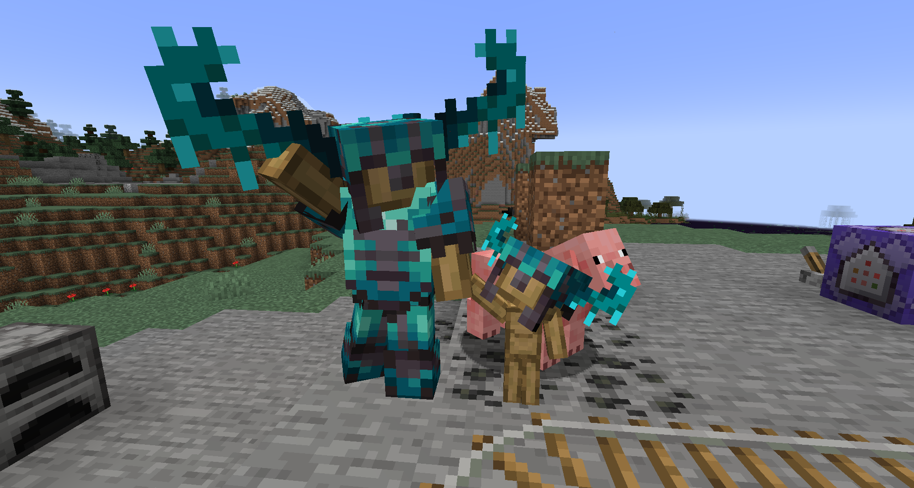
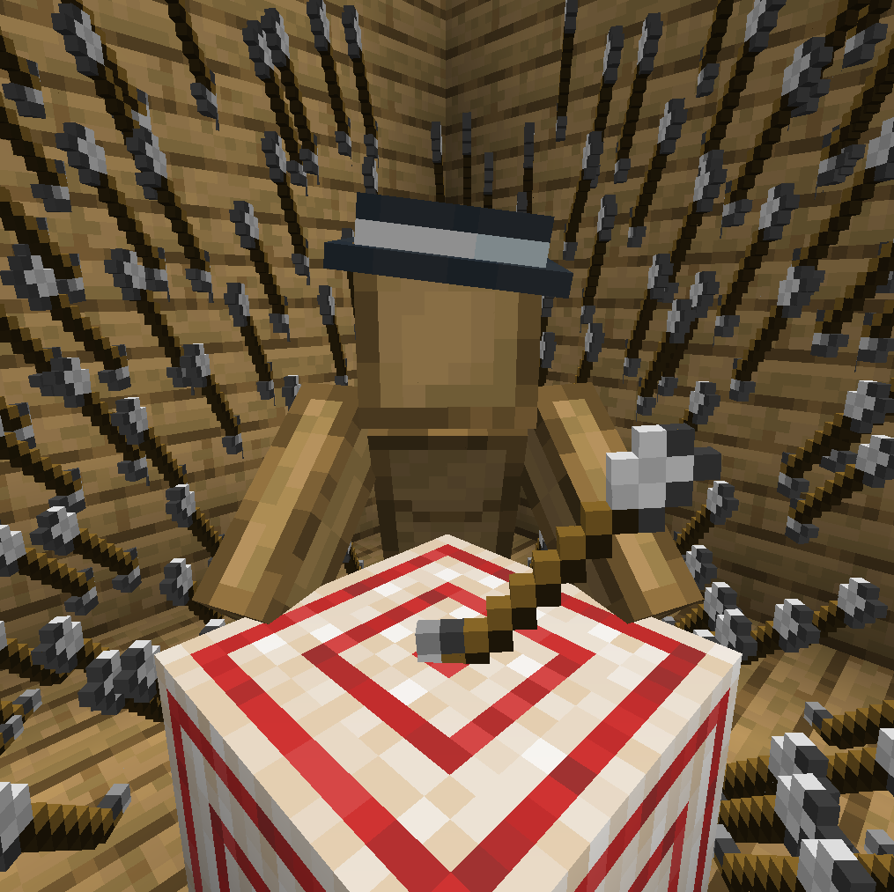

# CEM-S: Custom Entity Models with shaders




Pack adds primitive implementation of CEM on vanilla shaders.

It ables to render geometry in fragment as there is a way to get TBN matrix in it, finally.

## Features
It applies features to add or change geometry of entities with done functions `ADD_BOX`, `ADD_BOX_ROTATE` and `ADD_SQUARE` but you can add any [intersector function](https://iquilezles.org/articles/intersectors/) or even other techniques like raymarching.

Model has no limits in size and rotations but you should consider that entity culling is still vanilla.

May be used on any mobs, block enities (like chests, beds, bells, etc.), armors, trims, arrows, tridents, etc.

# Implementation (how to use)
To make base, add `includes`, base `cem_` variables and constructions:

### Vertex
```glsl
//right before main()
out vec4 cem_pos1, cem_pos2, cem_pos3, cem_pos4;
out vec3 cem_glPos;
out vec3 cem_uv1, cem_uv2;
out vec4 cem_lightMapColor;
flat out int cem;
flat out int cem_reverse;

//main() variables setup
vec4 modelPos = ModelViewMat * vec4(Position, 1.0);
const vec2[4] corners = vec2[4](vec2(0), vec2(0, 1), vec2(1, 1), vec2(1, 0));
vec2 corner = corners[gl_VertexID % 4];

cem_pos1 = cem_pos2 = cem_pos3 = cem_pos4 = vec4(0);
cem_uv1 = cem_uv2 = vec3(0);
cem = cem_reverse = 0;
float cem_size = 1;

//End of main()
if (cem != 0) //Setup CEM model
{
    #moj_import <cem/vert_setup.glsl>
}
```

### Fragment
```glsl
//Right before main()
#moj_import <cem/frag_funcs.glsl>

//Start of main (cem uses custom gl_FragDepth)
gl_FragDepth = gl_FragCoord.z;

//main() -- cem is applied like this
if (cem != 0)
{
    #moj_import <cem/frag_main_setup.glsl>

    float modelSize = 1;

    //Setup Switch
    switch (cem)
    {
        // // // // EXAMPLE
        case 1:
            modelSize = length((gl_PrimitiveID % 2 == 1 ? Pos1 : Pos2) - Pos3) / 8;
            break;
        // // // //
    }

    vec3 center = ((Pos1 + Pos2) / 2) * TBN;
    vec3 dir = normalize(cem_glPos);
    vec3 dirTBN = normalize(cem_glPos * TBN);
    
    float minT = MAX_DEPTH;
    color = vec4(0);

    //Model Switch
    switch (cem)
    {
        // // // // EXAMPLE
        case 1:
            ADD_BOX(vec3(0, -1, -1), vec3(2, 6, 2),     //Pos, Size,
            vec4(8, 16, 4, 4), vec4(4, 16, 4, 4),       //Down, Up,
            vec4(4, 20, 4, 12), vec4(0, 20, 4, 12),     //North, East,
            vec4(12, 20, 4, 12), vec4(8, 20, 4, 12))    //South, West
            
            ADD_BOX_ROTATE(vec3(4.35, 0, -4), //Pos,
                           vec3(0.5, 2.5, 2), //Size,
            
            //Rotation matrix by #moj_import <matf.glsl>
            Rotate3(sin(GameTime * 1000) * PI, Z), vec3(-0.5, 2.5, 0),
            
            vec4(23, 23, 1, 4), vec4(22, 23, 1, 4), //Down, Up,
            vec4(22, 27, 1, 5), vec4(18, 27, 4, 5), //North, East,
            vec4(27, 27, 1, 5), vec4(23, 27, 4, 5)) //South, West

            break;
        // // // //
    }

    if (minT == MAX_DEPTH)
        discard;

    writeDepth(dir * minT);
}

if (color.a < 0.1) {
    discard;
}

if (cem == 0) color *= vertexColor;
```

## Finding faces to CEM
To check if face must cem you may use texture and uv check.
To determine, you may set custom `pixel marker` somewhere on it and check this with shader.
Then you may check `UV` of model or texture `color` on vertices to decide if it's CEM.

You should set `cem` variable to manage model to render in fragment.

### Vertex
```glsl
//Add texture sampler (near to Sampler2 declaration)
uniform sampler2D Sampler0;

// // //main()
//Get absolute texture size
vec2 texSize = textureSize(Sampler0, 0);
vec2 uv = floor(UV0 * texSize);

///////EXAMPLE
if (texelFetch(Sampler0, ivec2(31, 0), 0) * 255 == vec4(0, 0, 1, 255)) //Arrow
{
    if (uv - corners[(gl_VertexID) % 4].yx * ivec2(16, 5) == vec2(0) && gl_VertexID / 4 % 3 == 1)
    {
        cem = 1;
        
        //Reverse ar/and reorder corners (sometimes it must be for some faces)
        //TODO: better way of reordering.
        cem_reverse = 1;
        corner = corners[(gl_VertexID) % 4].yx;
        
        cem_size = 1;
    }
    else
    {
        gl_Position = vec4(0);
    }
}
```

## Adding model

To add model, you have **setup switch** and **model switch**:

**Setup switch** sets `modelSize` and optional values before using `TBN` on `center` and `dirTBN`.

`modelSize` - calculatable proper size for model (it may be sized by vanilla model size like baby variants of model).
For comfortable use set it in pixels (1 for model = 1 pixel of its vanilla size).

**Model switch** sets the model with `ADD_SQUARE`, `ADD_BOX` and `ADD_BOX_ROTATE`:

`ADD_SQUARE` may be used to restore face as it is not displayed by default.

### Fragment
```glsl
//Setup Switch
switch (cem)
{
    // // // // EXAMPLE
    case 1:
        //8 is size of model in its pixels
        modelSize = length((gl_PrimitiveID % 2 == 1 ? Pos1 : Pos2) - Pos3) / 8;
        break;
    // // // //
}

// ... //

//Model Switch
switch (cem)
{
    // // // // EXAMPLE
    case 1:
        //May be used to restore vanilla
        ADD_SQUARE(vec3(-4, -9.5, 0), vec3(4, -9.5, 0), vec3(-4, 9.5, 0), vec4(stp + vec2(0, 64), res))

        ADD_BOX(vec3(0, -1, -1), vec3(2, 6, 2),     //Pos, Size,
        vec4(8, 16, 4, 4), vec4(4, 16, 4, 4),       //Down, Up,
        vec4(4, 20, 4, 12), vec4(0, 20, 4, 12),     //North, East,
        vec4(12, 20, 4, 12), vec4(8, 20, 4, 12))    //South, West
        
        ADD_BOX_ROTATE(vec3(4.35, 0, -4), //Pos,
                        vec3(0.5, 2.5, 2), //Size,
        
        //Rotation matrix by #moj_import <matf.glsl>
        Rotate3(sin(GameTime * 1000) * PI, Z), vec3(-0.5, 2.5, 0),
        
        vec4(23, 23, 1, 4), vec4(22, 23, 1, 4), //Down, Up,
        vec4(22, 27, 1, 5), vec4(18, 27, 4, 5), //North, East,
        vec4(27, 27, 1, 5), vec4(23, 27, 4, 5)) //South, West

        break;
    // // // //
}
```

# Compatibility (DIDN'T TESTED)
Most example packs probably work in 1.18.2 and above (may cause vertex reordering issues, but it's fixable).

Code snippets probably may work in 1.17 and above.

Mods compatibility:
- [x] Sodium
- [ ] Iris
- [x] Optifine
- [ ] Optifine (shaders)

## Known Issues
- Bobbing distortions (troubleshooting: switching out bobbing)

# Contributions, sources and licensing
https://iquilezles.org/articles/intersectors/
