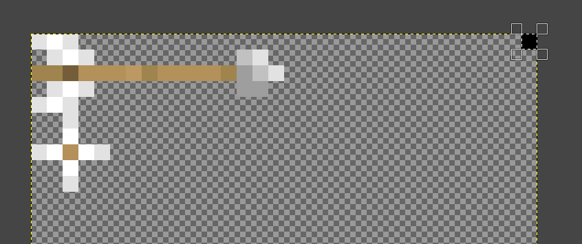

# CEM-S: Custom Entity Models with shaders


Pack adds primitive implementation of CEM on vanilla shaders.

It ables to render geometry in fragment as there is a way to TBN matrix in it, finally.

## Features
It applies features to add or change geometry of entities with done functions `ADD_BOX`, `ADD_BOX_ROTATE` and `ADD_SQUARE` but you can add any [intersector function](https://iquilezles.org/articles/intersectors/) or even other techniques like raymarching.

Model has no limits in size and rotations but you should consider that entity culling is still vanilla.

May be used on any mobs, block enities (like chests, beds, bells, etc.), armors, trims, arrows, tridents, etc.

# Implementation (WIP)
[Old implementation.](templates/impl.md)

## Setup
To setup pack, copy [include](include/) folder from this repository to your `minecraft/shaders/`.

Copy one of [templates](templates/) (there will be more templates and some of them may be same for some shaders) to `minecraft/shaders/core/`. (You can find shader for your kind of entity [here](https://github.com/McTsts/Minecraft-Shaders-Wiki/blob/main/Core%20Shader%20List.md).)

## Vertex

### Detection

#### Texture marking

Firstly, you need to check entity itself. To do this, you need **mark texture** by specific pixel. (you can do it with any image editor, like GIMP, Paint.net, Photoshop, etc.)  
*It works only for enities but not for some block-entities (chests, signs, beds) because they have atlas and this method is not so able for atlas.*

*Protip: you can mark entity by same pixel for one type of model (like arrows).*


Detection itself (example):
```glsl
//ivec2(X, Y) - coordinates of pixel
//vec4(R, G, B, A) - color of pixel 0..255 per channel
if (texelFetch(Sampler0, ivec2(31, 0), 0) * 255 == vec4(0, 0, 1, 255)) //Arrow
{
    //Next detection or cem declaration
}
```

#### UV0 and gl_VertexID detection
To find specific model *element* (face of model part, you need only one face for whole model's bone), you need to find specific **UV** and/or **vertices ID** (both in one gives more precise detection)

**Odd UV detection**  
For non-atlas texture, you can use this odd form of detection of UV:
```glsl
//ivec2(width, height) - texture size of element
//vec2(X, Y) - left up corner of texture
//corners[(gl_VertexID) % 4].yx - id-texture ordering (wtf)
uv - corners[(gl_VertexID) % 4].yx * ivec2(16, 5) == vec2(X, Y)
```
Where `corners` are:
```glsl
const vec2[4] corners = vec2[4](vec2(0), vec2(0, 1), vec2(1, 1), vec2(1, 0));
```
This thing helps to get same place in texture for all vertices but sometimes they have another order and you need to find a combination that respects your element by `corners[(gl_VertexID + OFFSET) % 4](.yx?)`... or changing array.

**ID detection**  
```glsl
gl_VertexID / 4 % FACE_COUNT == FACE_NUMBER
//FACE_COUNT - count of faces for whole model (for model made out of cubes CUBES_COUNT * 6)
```

Full example(from [this pack](examples/itemed%20arrows/assets/minecraft/shaders/core/rendertype_entity_cutout.vsh)):
```glsl
if (texelFetch(Sampler0, ivec2(31, 0), 0) * 255 == vec4(0, 0, 1, 255)) //Arrow
{
    if (uv - corners[(gl_VertexID) % 4].yx * ivec2(16, 5) == vec2(0) && gl_VertexID / 4 % 3 == 1)
    {
        cem = 1;
        cem_reverse = 1;
        corner = corners[(gl_VertexID) % 4].yx;
        cem_size = 1;
    }
    else
    {
        gl_Position = vec4(0);
    }
}
```

For atlas detection, combine texture detection with UV detection:
```glsl
texelFetch(Sampler0, ivec2(uv) - vec2(Xd, Yd) - corners[(gl_VertexID) % 4] * ivec2(W, H), 0) * 255 == vec4(R, G, B, A)
```

### CEM Declaration
```glsl
cem = 1; //Model ID

cem_reverse = 1; //Reverse XY of model if it seems to be inversed (Y goes down) Also can be use to mirror dublicate model like boots or hands of armor (optional)

corner = corners[(gl_VertexID) % 4].yx; //Change corner ordering to found one (optional)

cem_size = 1; //Change size of area (optional)
```

## Fragment
Models are stored in `switch (cem) {...}`

## Sculpting a model
Modelling technique is raytracing.  
["Bible" of raytracing here](https://raytracing.github.io/)

To make model, you have defines and basic intersector functions:
```glsl
// // // Defines

//Shorthand for sSquare
ADD_SQUARE(p1, p2, p3, uv)

//Shorthand for sBox
ADD_BOX(pos, size, dSide, uSide, nSide, eSide, sSide, wSide)

//Shorthand for sBox with rotation (+Rotation matrix and rotation pivot)
ADD_BOX_ROTATE(pos, size, Rotation, rotPivot, dSide, uSide, nSide, eSide, sSide, wSide)

// // // Functions
/*
ro = -center - pos;
rd = dirTBN or modified one;
p1, p2, p3 - points of square (0, 0) (1, 0) (0, 1);
tint - color to multiply (used for lighting);
color = color (past color to overlay on);
T = minT (past depth, new depth will be written in this);
#side - side of cube (down, up, north, east, south, west);
*/

vec4 sSquare(vec3 ro, vec3 rd, vec3 p1, vec3 p2, vec3 p3, vec4 tint, vec4 color, inout float T, vec4 uv)

vec4 sBox(vec3 ro, vec3 rd, vec3 size, mat3 TBN, vec4 color, inout float T, vec4 dSide, vec4 uSide, vec4 nSide, vec4 eSide, vec4 sSide, vec4 wSide)

// // // Raw Intersectors

vec3 triIntersect(in vec3 ro, in vec3 rd, in vec3 v0, in vec3 v1, in vec3 v2)

vec3 boxIntersect(vec3 ro, vec3 rd, vec3 size, out vec3 outNormal)
```
Examples of using and some other things are in [examples](examples/).

Intersectors functions:
https://iquilezles.org/articles/intersectors/

Also there is useful rotation function in `matf.glsl` like `Rotation3(angle(rad), EULER_AXIS(X|Y|Z))`.  
`PI` defined here too.

*You also can use raymarching technique*

##### Hope this doc helped.

# Compatibility (DIDN'T TESTED)
Most example packs probably work in 1.18.2 and above (may cause vertex reordering issues, but it's fixable).

Code snippets probably may work in 1.17 and above.

Mods compatibility:
- [x] Sodium
- [ ] Iris
- [x] Optifine
- [ ] Optifine (shaders)

## Known Issues
- ~~Bobbing distortions (troubleshooting: switching out bobbing)~~ (fixed)
- ~~Weird depth when camera is in box~~ (seems to be fixed)
- Doesn't work in GUI

# Contributions, sources and licensing
https://iquilezles.org/articles/intersectors/  
https://raytracing.github.io/